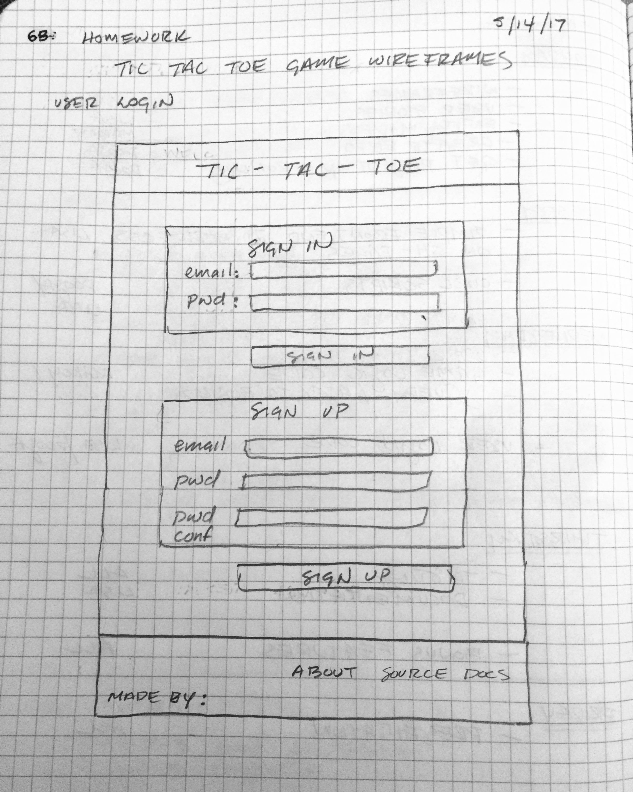
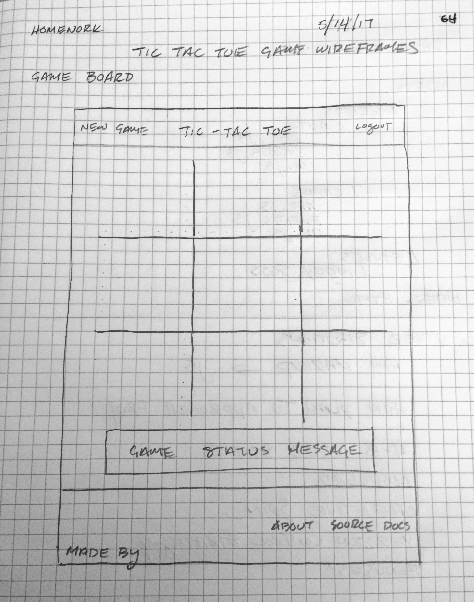

# Game Project Scope Study

## Required Readings

-   [Game Project](https://github.com/ga-wdi-boston/game-project)
-   [Game API](https://github.com/ga-wdi-boston/game-project-api)
-   [What is a User Story](https://www.mountaingoatsoftware.com/agile/user-stories)

## Deliverables

After reading the `game-project` prompt and the `game-project-api` documentation
please do the following and be prepared to share and discuss during our next
class.

Submit detailed answers to the following in this file via a pull request:

* Please see answers below question block. -- LW*

-   A wireframe of what your game project will look like.
-   The data structure you plan to use.
-   How you will take the markup of the game board and represent it in JS
-   How you plan to approach this project.
-   4-8 user stories for your game project.
-   How you plan to keep your code modular.
-   What creative spin will you add to your project?
-   How will you use version control to backup / track your project?
-   Do you plan to attempt any of the bonuses?

You may want to submit pictures for your wireframes and/or user stories.
[Markdown Cheatsheet](https://github.com/adam-p/markdown-here/wiki/Markdown-Cheatsheet)
has instructions to link to a picture you've uploaded to a service like [Imgur](http://imgur.com/).

# Tic-Tac-Toe Project Outline

---

## Wireframes

### User Login



### Tic-Tac-Toe Gameboard



## Data Structure

File structure for game assets and code:

```
/Assets
    /Scripts
        /Auth
          api.js
          events.js
          ui.js
        /Game
          api.js
          events.js
          index.js
          ui.js
      /Styles
          index.scss
  index.html

  ```

## How we will take the markup of the game board and represent it in JS

The game board will have 9 divs arranged in a grid via CSS.
Each div will contain an HTML element whose content we can change via jQuery
in response to user click events.

## How we plan to approach this project

Our team met over lunch on Friday to discuss the project.
We established a basic idea of how we would approach version control and got a sense of
how we would divide the tasks. We intend to use code review and pair programming so that
all team members become conversant with all aspects of the code.

## User Stories

* As a user, I want to be able to sign up for an account so I can play the game.
* As a user, I want to be able to sign in so I can play the game.
* As a user, when I sign in, I want to be presented with a fresh, empty game board so that I can begin playing.
* As a user, I want to be able to change the state of one grid space when I tap on it in order to change it from blank to occupied.
* As a user, I want to be able to offer the opportunity for a friend to play against me.
* As a user, I want to be able to click a 'new game' link in order to be presented with a blank game grid.
* As a user, I want to be presented with a statement indicating a game has been won and by which player (x or o).
* As a user, I want to be able to log out to end my game session.
* As a user, I want to be able to copy the game's URL and send it to a friend.

## How do you plan to keep your code modular?

I plan to use the same structure we have been using in class last week to divide functions into logical groups:

* ui.js for code that displays something to the user on the screen; api.js for code that makes API calls; event.js for event handlers; and index.js for organizing and linking to the relevant code files. Code to control the gameplay and code to control user authorization will also be separated.
* The presentation layer -- HTML and CSS  -- will be separate from the game logic and user authorization code.

## What creative spin do you want to add?

It would be fun to incorporate gifs as a reward to users for playing at the end of the game, or even as part of the gameplay if we had time to incorporate those features and meet the requirements of the project assignment.

## How will you use version control to backup / track your project?

We plan to have one team member establish the 'core' repository, with a master and a development branch. Other team members will clone this and make pull requests to the core repository.

## Do you plan to attempt any of the bonuses?

It's more important for our team to meet the project requirements and to provide clean, tested, and documented code than it is to include bonus features, so we will only attempt bonuses if we have code that we feel is solid and well-documented by the end of Thursday.
